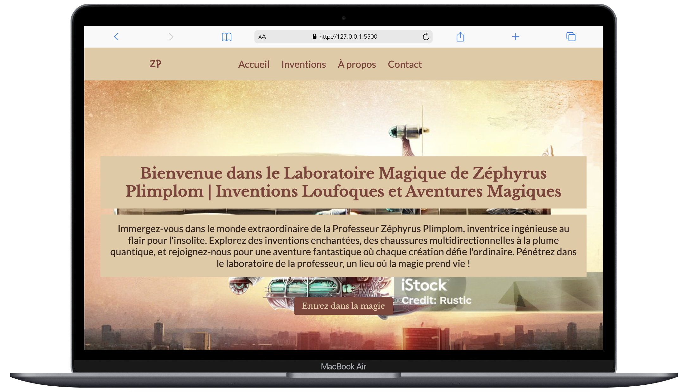
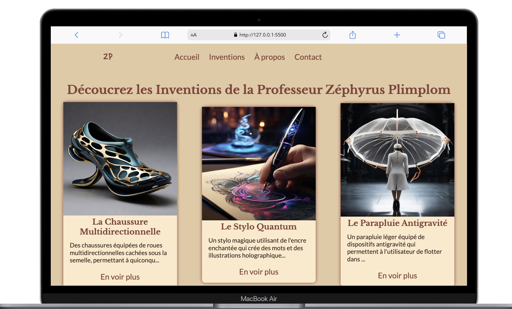
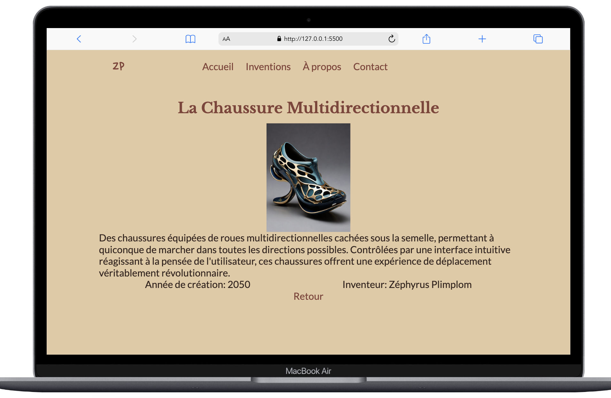
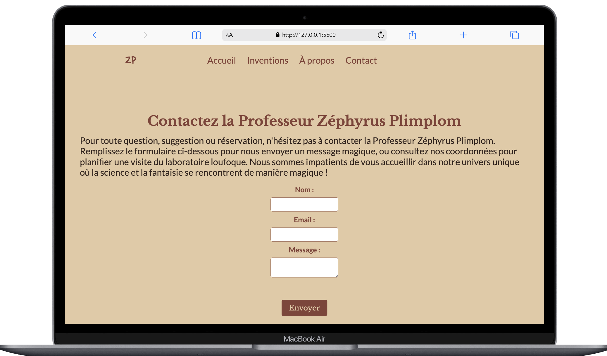

## Welcome to Zéphyrus Plimplom | Inventions 👋
#### Author
👤 Jay Viannay

Github: @JayViannay <br>
Project Overview <br>

>Welcome to the fascinating world of Professor Zéphyrus Plimplom, where science meets fantasy through whimsical inventions. This educational project allows students to explore a broken version of a website and add the missing functionalities. The code serves as a starting point, with placeholders (TODO:) where students are expected to work.

#### Getting Started
Clone the repository:
```bash
git clone https://github.com/JayViannay/zephyrus-plimplom-inventions.git
cd zephyrus-plimplom-inventions
```
Explore the existing code:

The `index.html` file contains the completed homepage, providing examples for displaying inventions.
- Work on inventions.html to implement the display of all inventions.
- Customize invention.html to show the details of a specific invention.
- Implement the contact form functionality in contact_form.js.
- Customize Styles:
Explore and modify style.css to enhance the visual appeal of the website.
Add your creative touch to make the site more attractive.

Documentation:
- Add clear comments to explain each modification or addition to the code.
- Document the purpose of your changes to aid understanding.
  
Bonus Features:
- Explore and understand the files in the services folder.
- Consider adding extra features like animations or visual effects.


#### Screenshots of the Project
- Accueil Desktop


- Inventions desktop


- Invention desktop


- Contact desktop
